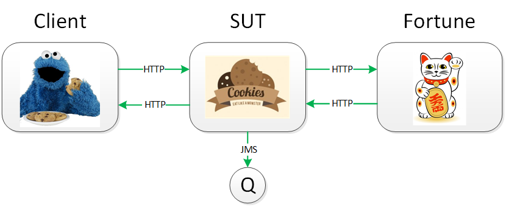
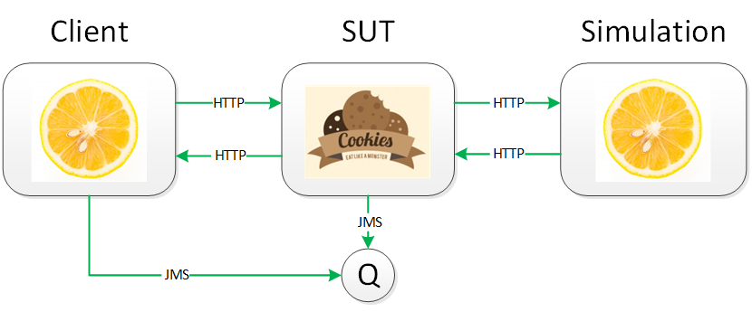

# cookie-factory
Example project to showcase integration testing with Citrus and Cucumber

## Overview
The cookie factory is a typical integration service scenario:


* It offers an HTTP service to order cookies
* Under certain conditions, it calls a backend service (here to get a fortune when fortune cookies are ordered)
* The cookies are produced asynchronously (represented by a JMS message sent to a queue)

## Testing challenges
To test the cookie factory thoroughly, you have to:
* Send cookie orders
* Assert the order responses
* Assert the resulting JMS messages
* Assert the requests sent to the fortune service
* Control the fortune service responses to control the further processing inside the cookie factory

## Test setup
When the cookie factory is tested with Citrus, the setup is as follows:


* Citrus is the test driver
* It sends an order to the cookie factory, receives and asserts the response
* It also consumes and asserts the resulting JMS message (for positive tests, otherwise no message is sent)
* The fortune service URL of the cookie factory points to `localhost` for the tests
* Therefore Citrus can simulate the fortune service
* It receives and asserts the fortune request and sends a pre-defined response

## Project structure
The project is a Maven multi-module project with the following modules:
* cookie-factory: The system under test.
* citrus: Integration tests written with Citrus.
* citrus-dry: The same tests as in `citrus`, but optimized with `Behavior`s to avoid code duplication.
* cucumber: The same tests again, but written as Cucumber testspecs and gluecode written with Citrus.
* cucumber-dry: The same tests as in `cucumber`, but optimized with `Background` and `Scenario Outline` to avoid duplication in testspecs.

## Run the cookie factory and the tests against it

### Start the JMS broker
```
cd [your download location]\cookie-factory\cookie-factory
mvn activemq:run
```

### Start the application
```
cd [your download location]\cookie-factory\cookie-factory
mvn spring-boot:run
```

### Run the integration tests
```
cd [your download location]\cookie-factory\citrus (or one of the other test modules)
mvn verify
```
